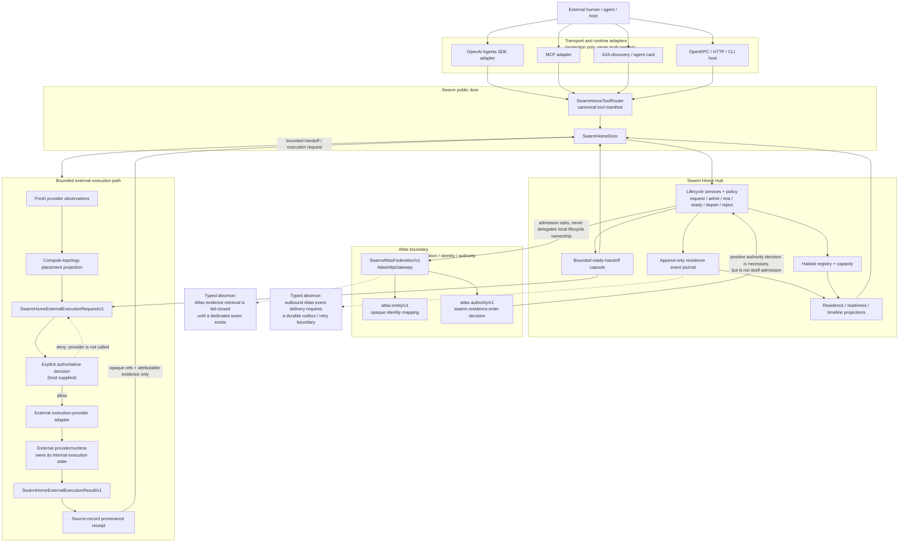

# Swarm Home Hub Architecture Map

This is a **projection over the existing public implementation**, not a new source of truth.

Its purpose is to let a reviewer see the system boundary, canonical ownership, Atlas seam, execution-provider path, and evidence flow without reconstructing them from multiple documents.

## Projection boundary

- **What does this map own?** Nothing. It owns no state, policy, identity, event, or authority.
- **What does it know?** Only the public contracts, services, adapters, projections, and documented typed absences already present in this repository.
- **What events does it emit?** None.
- **What relationships does it maintain?** None. It visualises relationships already implemented elsewhere.

If this map conflicts with executable code or a canonical contract, the executable boundary wins and the map should be corrected.

## One-page map

## What the map is saying

### 1. Adapters are not the system

OpenAI Agents SDK, MCP, A2A, OpenRPC, HTTP, and CLI surfaces project the same bounded tool semantics inward.

They do not get their own residence state machine, authority database, or canonical identity.

### 2. Swarm owns one narrow domain

Swarm Home Hub owns:

- residence lifecycle for admitted agent identities;
- habitat and capacity state;
- local rest/readiness projection;
- bounded ready-handoff state;
- the attributable event path supporting those projections.

Current state is derived from events. The event path is not rewritten to make the current snapshot look cleaner.

### 3. Atlas remains outside the product boundary

Swarm is **not Atlas**.

The current federation seam lets Atlas resolve an opaque agent identity and answer the bounded `swarm.residence.enter` authority question.

A positive Atlas decision does not become admission by itself. Swarm still applies local habitat capacity and lifecycle policy.

The wider Atlas spine remains:

**Identity · Events · Relationships · Evidence · Stewardship**

Swarm consumes bounded contracts from that spine rather than duplicating it.

### 4. External execution remains externally owned

The execution-provider path can select from fresh provider observations, create a bounded request, require explicit authority, call a provider, and preserve the observed result as provenance.

It does **not** import the provider's task database, queue, worker fleet, memory, schedule engine, conversation history, or internal event stream.

The provider remains canonical for its own execution state.

### 5. Evidence never becomes permission by proximity

A provider result, trace, receipt, capability, price paid, runtime identity, or successful connection is not authority.

The system preserves evidence so later reasoning can inspect what happened. Authority remains an explicit decision boundary.

## Reviewer path

If you have five minutes:

1. Read this map.
2. Read [TECHNICAL-EVALUATION.md](TECHNICAL-EVALUATION.md).
3. Run the proof in [DEMO.md](DEMO.md).
4. Inspect [PLATFORM_DOOR.md](PLATFORM_DOOR.md) and [ATLAS_FEDERATION.md](ATLAS_FEDERATION.md).
5. For bounded external execution, read [END_TO_END_EXECUTION_PROOF.md](END_TO_END_EXECUTION_PROOF.md) and [EXTERNAL_EXECUTION_PROVIDER.md](EXTERNAL_EXECUTION_PROVIDER.md).

The goal is not to make the architecture look large.

The goal is to make **ownership, authority, event flow, and typed absence visible enough that a stranger does not need to become an archaeologist first**.
